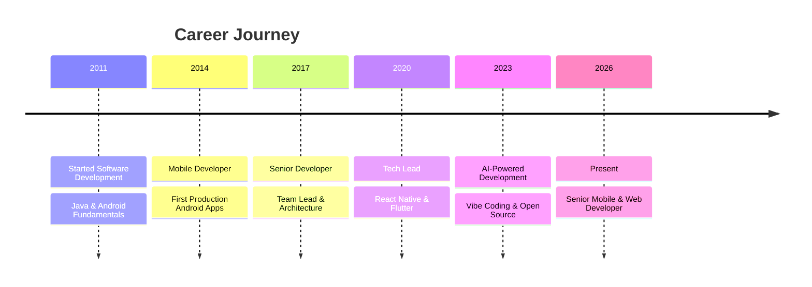

<!-- ═══════════════════════════════════════════════════════════════════════════════════════════════════════════ -->
<!--                                                                                                             -->
<!--   ███████╗██╗████████╗██╗  ██╗ █████╗ ██████╗  █████╗      ██╗                                               -->
<!--   ██╔════╝██║╚══██╔══╝██║  ██║██╔══██╗██╔══██╗██╔══██╗     ██║                                               -->
<!--   ███████╗██║   ██║   ███████║███████║██████╔╝███████║     ██║                                               -->
<!--   ╚════██║██║   ██║   ██╔══██║██╔══██║██╔══██╗██╔══██║██   ██║                                               -->
<!--   ███████║██║   ██║   ██║  ██║██║  ██║██║  ██║██║  ██║╚█████╔╝                                               -->
<!--   ╚══════╝╚═╝   ╚═╝   ╚═╝  ╚═╝╚═╝  ╚═╝╚═╝  ╚═╝╚═╝  ╚═╝ ╚════╝                                                -->
<!--                                                                                                             -->
<!--             🚀 SENIOR DEVELOPER • AI PIONEER • VIBE CODING EXPERT • OPEN SOURCE CREATOR 🚀                  -->
<!--                                                                                                             -->
<!-- ═══════════════════════════════════════════════════════════════════════════════════════════════════════════ -->

<!-- Animated Header with Wave Effect -->
<p align="center">
  
</p>

<!-- Glowing Name with 3D Effect -->
<p align="center">
  
</p>

<!-- Animated Subtitle -->
<p align="center">
  
</p>

<!-- Animated Line Divider -->
<p align="center">
  
</p>

<!-- Social Badges with Hover Effect -->
<p align="center">
  <a href="https://linkedin.com/in/sitharaj08">
    
  </a>
  &nbsp;
  <a href="https://sitharaj.in">
    
  </a>
  &nbsp;
  <a href="mailto:sitharaj.info@gmail.com">
    
  </a>
  &nbsp;
  <a href="https://www.npmjs.com/~sitharaj88">
    
  </a>
  &nbsp;
  <a href="https://github.com/sitharaj88?tab=followers">
    
  </a>
</p>

<!-- Stats Row -->
<p align="center">
  
  &nbsp;
  
  &nbsp;
  
</p>

<!-- Animated Separator -->
<p align="center">
  
</p>

---

<!-- ═══════════════════════════════════════════════════════════════════════════════════════════════════════════ -->
<!-- SECTION: ABOUT ME                                                                                           -->
<!-- ═══════════════════════════════════════════════════════════════════════════════════════════════════════════ -->

##  About Me

<table>
<tr>
<td width="50%">

###  Hey there! I'm Sitharaj

I'm a **Senior Mobile & Web Developer** with **13+ years** of experience building world-class digital products. I specialize in crafting **fast, beautiful, and scalable applications** across multiple platforms.

**🎯 What defines me:**
- 🚀 **Speed** — Ship production apps at lightning speed
- 🎨 **Quality** — Clean architecture & beautiful UIs
- 🤖 **AI-First** — Leverage AI tools for 10x productivity
- 🌟 **Open Source** — Active maintainer & contributor

> *"Build fast. Ship faster. Iterate always."* ⚡

</td>
<td width="50%">


</td>
</tr>
</table>

###  Quick Overview

<p align="center">
  
  
  
</p>

<p align="center">
  
</p>

###  What I Do Best

<p align="center">
  
</p>
<p align="center">
  
</p>
<p align="center">
  
</p>
<p align="center">
  
</p>

###  Current Focus

<p align="center">
  
  
  
  
</p>

---

<!-- ═══════════════════════════════════════════════════════════════════════════════════════════════════════════ -->
<!-- SECTION: CURRENTLY LEARNING                                                                                 -->
<!-- ═══════════════════════════════════════════════════════════════════════════════════════════════════════════ -->

##  Currently Learning: Gen AI Development

> *Deep diving into the future of software development with Generative AI*

### 🧠 Large Language Models (LLMs)

<table>
<tr>
<td width="50%">

**🔬 Model Architectures & Fine-tuning**
- Transformer architecture deep dive
- LoRA & QLoRA fine-tuning techniques
- Prompt engineering & optimization
- Model quantization (GGUF, GPTQ, AWQ)
- Local LLM deployment (Ollama, LM Studio)

</td>
<td width="50%">

**🏗️ RAG & Vector Databases**
- Retrieval-Augmented Generation (RAG)
- Vector embeddings & similarity search
- ChromaDB, Pinecone, Weaviate
- Document chunking strategies
- Hybrid search techniques

</td>
</tr>
</table>

### ⚡ AI Development Frameworks & Tools

<p align="center">
  
  
  
  
</p>
<p align="center">
  
  
  
  
</p>

### 🔥 Current Gen AI Trends I'm Exploring

<table>
<tr>
<td align="center" width="25%">

<br><b>AI Agents</b>
<br><sub>Autonomous agents, tool use, ReAct pattern, AutoGPT-style workflows</sub>
</td>
<td align="center" width="25%">

<br><b>Agentic Coding</b>
<br><sub>Claude Code, Cursor, Windsurf, AI pair programming</sub>
</td>
<td align="center" width="25%">

<br><b>Multi-Modal AI</b>
<br><sub>Vision models, image generation, video understanding</sub>
</td>
<td align="center" width="25%">

<br><b>Voice & Speech</b>
<br><sub>Text-to-speech, speech recognition, voice cloning</sub>
</td>
</tr>
<tr>
<td align="center" width="25%">

<br><b>AI Orchestration</b>
<br><sub>LangGraph, CrewAI, multi-agent systems</sub>
</td>
<td align="center" width="25%">

<br><b>Knowledge Graphs</b>
<br><sub>GraphRAG, Neo4j, entity extraction</sub>
</td>
<td align="center" width="25%">

<br><b>On-Device AI</b>
<br><sub>Mobile ML, Edge AI, MLKit, CoreML</sub>
</td>
<td align="center" width="25%">

<br><b>AI Safety</b>
<br><sub>Guardrails, prompt injection prevention, responsible AI</sub>
</td>
</tr>
</table>

### 📚 Learning Resources I'm Using

<p align="center">
  
  
  
  
  
  
</p>

---

<!-- ═══════════════════════════════════════════════════════════════════════════════════════════════════════════ -->
<!-- SECTION: AI & VIBE CODING                                                                                   -->
<!-- ═══════════════════════════════════════════════════════════════════════════════════════════════════════════ -->

##  AI & Vibe Coding Arsenal

> *"The future of coding is collaboration between human creativity and AI capabilities"*

### 🧠 AI Assistants & LLMs

<p align="center">
  
  
  
  
  
</p>

### ⚡ Vibe Coding IDEs & Tools

<p align="center">
  
  
  
  
  
</p>

### 🤝 AI Pair Programming

<p align="center">
  
  
  
  
</p>

### 🎨 AI Design & Generation

<p align="center">
  
  
  
  
</p>

---

<!-- ═══════════════════════════════════════════════════════════════════════════════════════════════════════════ -->
<!-- SECTION: TROPHIES                                                                                           -->
<!-- ═══════════════════════════════════════════════════════════════════════════════════════════════════════════ -->

##  GitHub Achievements

<p align="center">
  
</p>

---

<!-- ═══════════════════════════════════════════════════════════════════════════════════════════════════════════ -->
<!-- SECTION: GITHUB ANALYTICS                                                                                   -->
<!-- ═══════════════════════════════════════════════════════════════════════════════════════════════════════════ -->

##  GitHub Analytics Dashboard

### 📈 Performance Metrics

<p align="center">
  
  
</p>

### 📊 Contribution Overview

<p align="center">
  
</p>

<p align="center">
  
  
  
</p>

### ⏰ Coding Activity

<p align="center">
  
  
</p>

### 📈 Activity Graph

<p align="center">
  
</p>

### 🐍 Contribution Snake

<p align="center">
  <picture>
    <source media="(prefers-color-scheme: dark)" srcset="https://raw.githubusercontent.com/platane/snk/output/github-contribution-grid-snake-dark.svg">
    <source media="(prefers-color-scheme: light)" srcset="https://raw.githubusercontent.com/platane/snk/output/github-contribution-grid-snake.svg">
    
  </picture>
</p>

---

<!-- ═══════════════════════════════════════════════════════════════════════════════════════════════════════════ -->
<!-- SECTION: TECH STACK                                                                                         -->
<!-- ═══════════════════════════════════════════════════════════════════════════════════════════════════════════ -->

##  Technology Stack

<details open>
<summary><b>📱 Mobile Development</b> — Native & Cross-Platform Excellence</summary>
<br>

| Technology | Proficiency | Years | Notes |
|:-----------|:------------|:------|:------|
|  | ██████████ 100% | 13+ | Expert - Kotlin, Java, Jetpack Compose |
|  | ██████████ 100% | 8+ | Primary language for Android |
|  | █████████░ 95% | 13+ | Enterprise & Android development |
|  | █████████░ 90% | 5+ | Cross-platform mobile apps |
|  | ████████░░ 85% | 4+ | Beautiful cross-platform UIs |
|  | ███████░░░ 75% | 3+ | Swift, SwiftUI |
|  | ████████░░ 85% | 4+ | Flutter development |

</details>

<details open>
<summary><b>🎨 Frontend Development</b> — Modern Web Technologies</summary>
<br>

| Technology | Proficiency | Years | Notes |
|:-----------|:------------|:------|:------|
|  | ██████████ 100% | 6+ | SPA, SSR, Hooks, Context |
|  | █████████░ 95% | 5+ | Type-safe JavaScript |
|  | █████████░ 90% | 4+ | Full-stack React framework |
|  | ██████████ 100% | 10+ | ES6+, Modern JS |
|  | █████████░ 90% | 3+ | Utility-first CSS |
|  | █████████░ 90% | 2+ | Next-gen build tool |
|  | ██████████ 100% | 13+ | Semantic HTML |
|  | ██████████ 100% | 13+ | Modern CSS, Animations |

</details>

<details open>
<summary><b>⚙️ Backend & Cloud</b> — Scalable Infrastructure</summary>
<br>

| Technology | Proficiency | Years | Notes |
|:-----------|:------------|:------|:------|
|  | █████████░ 95% | 7+ | Server-side JavaScript |
|  | █████████░ 95% | 7+ | REST APIs, middleware |
|  | █████████░ 90% | 6+ | Auth, Firestore, Functions |
|  | ████████░░ 80% | 4+ | Cloud Run, Cloud Functions |
|  | ████████░░ 85% | 5+ | Relational databases |
|  | ████████░░ 85% | 5+ | NoSQL databases |
|  | ███████░░░ 75% | 3+ | Caching, sessions |
|  | ███████░░░ 75% | 3+ | API query language |

</details>

<details>
<summary><b>🔧 DevOps & Tools</b> — Development Workflow</summary>
<br>

| Technology | Proficiency | Years | Notes |
|:-----------|:------------|:------|:------|
|  | ██████████ 100% | 13+ | Version control |
|  | ██████████ 100% | 10+ | CI/CD, Actions, Packages |
|  | ████████░░ 80% | 4+ | Containerization |
|  | ██████████ 100% | 8+ | Primary IDE |
|  | ██████████ 100% | 10+ | Android IDE |
|  | ███████░░░ 75% | 3+ | iOS development |
|  | █████████░ 90% | 6+ | API testing |
|  | ████████░░ 80% | 4+ | UI/UX design |

</details>

<details>
<summary><b>🧪 Testing & Quality</b> — Code Quality Assurance</summary>
<br>

| Technology | Proficiency | Years | Notes |
|:-----------|:------------|:------|:------|
|  | █████████░ 90% | 5+ | JavaScript testing |
|  | █████████░ 90% | 2+ | Fast unit testing |
|  | ████████░░ 80% | 2+ | E2E testing |
|  | █████████░ 90% | 10+ | Java/Kotlin testing |
|  | █████████░ 95% | 6+ | Code linting |
|  | █████████░ 95% | 5+ | Code formatting |

</details>

---

<!-- ═══════════════════════════════════════════════════════════════════════════════════════════════════════════ -->
<!-- SECTION: FEATURED PROJECTS                                                                                  -->
<!-- ═══════════════════════════════════════════════════════════════════════════════════════════════════════════ -->

##  Featured Projects

### 🛠️ Developer Tools

<p align="center">
  <a href="https://github.com/sitharaj88/sqlens">
    
  </a>
  <a href="https://github.com/sitharaj88/scaffoldkit">
    
  </a>
</p>

### 🔷 Kotlin Multiplatform Libraries

<p align="center">
  <a href="https://github.com/sitharaj88/redux-kmp">
    
  </a>
  <a href="https://github.com/sitharaj88/vaultkmp">
    
  </a>
</p>

<p align="center">
  <a href="https://github.com/sitharaj88/sentinel-kmp">
    
  </a>
  <a href="https://github.com/sitharaj88/kronosync">
    
  </a>
</p>

### ⚛️ React & TypeScript Libraries

<p align="center">
  <a href="https://github.com/sitharaj88/react-unified-storage">
    
  </a>
  <a href="https://github.com/sitharaj88/foundry-orm">
    
  </a>
</p>

### 📱 Android Libraries

<p align="center">
  <a href="https://github.com/sitharaj88/android-compose-keyboard-visibility">
    
  </a>
  <a href="https://github.com/sitharaj88/android-mvvm-clean-architecture">
    
  </a>
</p>

<p align="center">
  <a href="https://github.com/sitharaj88?tab=repositories">
    
  </a>
</p>

---

<!-- ═══════════════════════════════════════════════════════════════════════════════════════════════════════════ -->
<!-- SECTION: NPM PACKAGES                                                                                       -->
<!-- ═══════════════════════════════════════════════════════════════════════════════════════════════════════════ -->

##  NPM Package Ecosystem

<table align="center">
  <tr>
    <td align="center">
      <a href="https://npmjs.com/package/quartz-ui">
        
        <br>
        
      </a>
      <br><sub>Modern UI Toolkit</sub>
    </td>
    <td align="center">
      <a href="https://npmjs.com/package/foundry-orm">
        
        <br>
        
      </a>
      <br><sub>TypeScript ORM</sub>
    </td>
    <td align="center">
      <a href="https://npmjs.com/package/log-tonic">
        
        <br>
        
      </a>
      <br><sub>Structured Logging</sub>
    </td>
  </tr>
  <tr>
    <td align="center">
      <a href="https://npmjs.com/package/mat-design-colors">
        
        <br>
        
      </a>
      <br><sub>Material Colors</sub>
    </td>
    <td align="center">
      <a href="https://npmjs.com/package/react-material-pull-to-refresh">
        
        <br>
        
      </a>
      <br><sub>Pull to Refresh</sub>
    </td>
    <td align="center">
      <a href="https://npmjs.com/package/react-material-bottom-sheet">
        
        <br>
        
      </a>
      <br><sub>Bottom Sheet</sub>
    </td>
  </tr>
  <tr>
    <td align="center">
      <a href="https://npmjs.com/package/rn-structured-logger">
        
        <br>
        
      </a>
      <br><sub>RN Logger</sub>
    </td>
    <td align="center">
      <a href="https://npmjs.com/package/react-unified-storage">
        
        <br>
        
      </a>
      <br><sub>Unified Storage</sub>
    </td>
    <td align="center">
      <a href="https://www.npmjs.com/~sitharaj88">
        
        <br>
        <sub>📦</sub>
      </a>
      <br><sub>All Packages</sub>
    </td>
  </tr>
</table>

---

<!-- ═══════════════════════════════════════════════════════════════════════════════════════════════════════════ -->
<!-- SECTION: MAVEN CENTRAL LIBRARIES                                                                            -->
<!-- ═══════════════════════════════════════════════════════════════════════════════════════════════════════════ -->

##  Maven Central Libraries

> **Kotlin Multiplatform Libraries** — Supporting Android, iOS, Desktop, and Web platforms

<table align="center">
  <tr>
    <td align="center" width="33%">
      <a href="https://central.sonatype.com/search?q=in.sitharaj.sentinel">
        
      </a>
      <br><br>
      <b>🛡️ Sentinel</b>
      <br>
      <sub>Enterprise-grade KMP Permissions Library</sub>
      <br><br>
      
      
      
      
    </td>
    <td align="center" width="33%">
      <a href="https://central.sonatype.com/search?q=in.sitharaj.reduxkmp">
        
      </a>
      <br><br>
      <b>🔄 Redux KMP</b>
      <br>
      <sub>Predictable State Container for KMP</sub>
      <br><br>
      
      
      
      
    </td>
    <td align="center" width="33%">
      <a href="https://central.sonatype.com/search?q=in.sitharaj.parcel">
        
      </a>
      <br><br>
      <b>📁 Parcel</b>
      <br>
      <sub>KMP File Picker & Share Library</sub>
      <br><br>
      
      
      
      
    </td>
  </tr>
  <tr>
    <td align="center" width="33%">
      <a href="https://central.sonatype.com/search?q=in.sitharaj.krate">
        
      </a>
      <br><br>
      <b>📦 Krate</b>
      <br>
      <sub>Enterprise-grade KMP File System Library</sub>
      <br><br>
      
      
      
      
    </td>
    <td align="center" width="33%">
      <a href="https://central.sonatype.com/search?q=in.sitharaj+vaultkmp">
        
      </a>
      <br><br>
      <b>🔐 VaultKMP</b>
      <br>
      <sub>Secure Encrypted Key-Value Storage</sub>
      <br><br>
      
      
      
    </td>
    <td align="center" width="33%">
      <a href="https://central.sonatype.com/search?q=in.sitharaj+kronosync">
        
      </a>
      <br><br>
      <b>⏱️ Kronosync</b>
      <br>
      <sub>KMP SNTP Client for Time Sync</sub>
      <br><br>
      
      
      
      
    </td>
  </tr>
</table>

<p align="center">
  <a href="https://central.sonatype.com/search?q=in.sitharaj">
    
  </a>
</p>

---

<!-- ═══════════════════════════════════════════════════════════════════════════════════════════════════════════ -->
<!-- SECTION: EXPERIENCE                                                                                         -->
<!-- ═══════════════════════════════════════════════════════════════════════════════════════════════════════════ -->

##  Professional Experience



### 🏆 Key Achievements

- 📱 **Led 15+ mobile app projects** from concept to production
- 🌟 **Published 10+ NPM packages** with combined downloads
- 🔧 **Built SDKs and libraries** used by developers worldwide
- 🚀 **Shipped apps with millions of downloads** on Play Store
- 📝 **Technical writer and educator** through blogs and tutorials

---

<!-- ═══════════════════════════════════════════════════════════════════════════════════════════════════════════ -->
<!-- SECTION: INTERESTS                                                                                          -->
<!-- ═══════════════════════════════════════════════════════════════════════════════════════════════════════════ -->

##  Areas of Interest

<p align="center">

| 📱 Mobile | 🌐 Web | ☁️ Cloud | 🤖 AI/ML |
|:----------|:-------|:---------|:---------|
| Native Android | React & Next.js | Firebase | LLMs & Agents |
| iOS Development | Progressive Web Apps | Google Cloud | AI Tools |
| React Native | TypeScript | Serverless | Vibe Coding |
| Flutter | TailwindCSS | Microservices | Automation |

</p>

<p align="center">

| 🎨 Design | 🔧 Tools | 🔭 IoT | 📚 Learning |
|:----------|:---------|:-------|:------------|
| UI/UX Design | Developer Tools | Embedded Systems | System Design |
| Design Systems | CLI Applications | Microcontrollers | Architecture |
| Animations | SDKs & Libraries | IoT Protocols | Cloud Patterns |
| Accessibility | Build Tools | Hardware | Best Practices |

</p>

---

<!-- ═══════════════════════════════════════════════════════════════════════════════════════════════════════════ -->
<!-- SECTION: WEBSITE                                                                                            -->
<!-- ═══════════════════════════════════════════════════════════════════════════════════════════════════════════ -->

##  My Digital Home — [sitharaj.in](https://sitharaj.in)

<table align="center">
  <tr>
    <td align="center" width="25%">
      <br>
      <b>📚 Tutorials</b><br>
      <sub>In-depth guides on<br>Kotlin, Android, React Native,<br>Flutter, TypeScript, AI/ML</sub>
    </td>
    <td align="center" width="25%">
      <br>
      <b>📝 Technical Blog</b><br>
      <sub>Articles on architecture,<br>productivity, dev tools,<br>open source insights</sub>
    </td>
    <td align="center" width="25%">
      <br>
      <b>🤖 AI/ML Hub</b><br>
      <sub>LLM guides, AI tool demos,<br>local model setups,<br>vibe coding tutorials</sub>
    </td>
    <td align="center" width="25%">
      <br>
      <b>🛠 Dev Tools</b><br>
      <sub>JSON tools, API testing,<br>color utilities, formatters,<br>code helpers</sub>
    </td>
  </tr>
</table>

---

<!-- ═══════════════════════════════════════════════════════════════════════════════════════════════════════════ -->
<!-- SECTION: CURRENT FOCUS                                                                                      -->
<!-- ═══════════════════════════════════════════════════════════════════════════════════════════════════════════ -->

##  What I'm Currently Doing

```diff
@@                     2026 Focus Areas                        @@
==================================================================

+ 🔥 Mastering Vibe Coding with AI pair programmers
+ 🤖 Building AI-powered developer tools & automation
+ 📱 Shipping cross-platform apps at lightning speed
+ 🌟 Growing the open source package ecosystem
+ 📚 Creating tutorials on modern development practices
+ 🎯 Exploring advanced system design patterns

- ❌ Writing boilerplate code manually
- ❌ Ignoring AI advancements in development
- ❌ Building without proper architecture

! 💡 Philosophy: Leverage AI to amplify human creativity
! 🚀 Goal: Build 10x faster while maintaining quality
```

---

<!-- ═══════════════════════════════════════════════════════════════════════════════════════════════════════════ -->
<!-- SECTION: CONNECT                                                                                            -->
<!-- ═══════════════════════════════════════════════════════════════════════════════════════════════════════════ -->

##  Let's Connect

<p align="center">
  <a href="https://linkedin.com/in/sitharaj08">
    
  </a>
  <a href="https://sitharaj.in">
    
  </a>
  <a href="https://github.com/sitharaj88">
    
  </a>
  <a href="mailto:sitharaj.info@gmail.com">
    
  </a>
</p>

<p align="center">
  
</p>

<p align="center">
  <b>🌟 Love connecting with fellow developers, tech enthusiasts, and open source contributors!</b>
</p>

---

<!-- Footer -->
<p align="center">
  
</p>

<p align="center">
  
</p>

<p align="center">
  <sub>⭐ Star my repos if you find them useful! • Made with ❤️ and ☕ by Sitharaj</sub>
</p>
