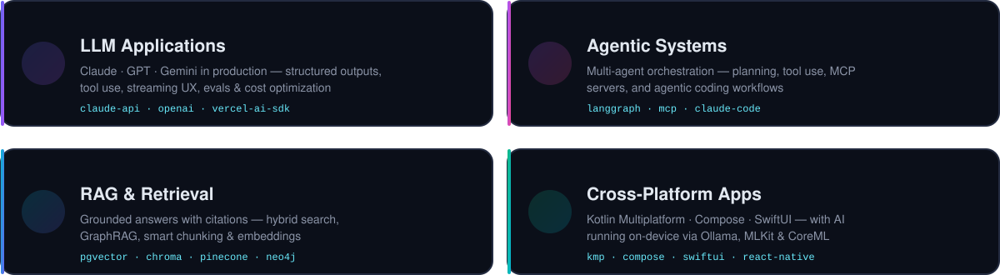

<!-- Custom animated header (assets/header.svg) -->

  

  
  &nbsp;
  
  &nbsp;
  
  &nbsp;
  

 

I turn ideas into production software — **13+ years** across mobile, web, and now **AI-native systems**.
These days that means LLM agents, RAG pipelines, and MCP tooling, shipped inside apps built with
Kotlin Multiplatform, React, and TypeScript. Author of open source libraries on
[npm](https://www.npmjs.com/~sitharaj08) and [Maven Central](https://central.sonatype.com/search?q=in.sitharaj).

 

## What I Build

  

## Stack

  

  <code>Claude API</code> · <code>LangChain / LangGraph</code> · <code>LlamaIndex</code> · <code>Hugging Face</code> · <code>MCP</code> · <code>pgvector</code> · <code>Ollama</code>

## Featured Work

  
  

  
  

  
  

  

## Published Libraries

  
  
  
  
  
  

  
  
  
  
  
  

## GitHub

  
  

<!-- Custom animated footer (assets/footer.svg) -->

  

